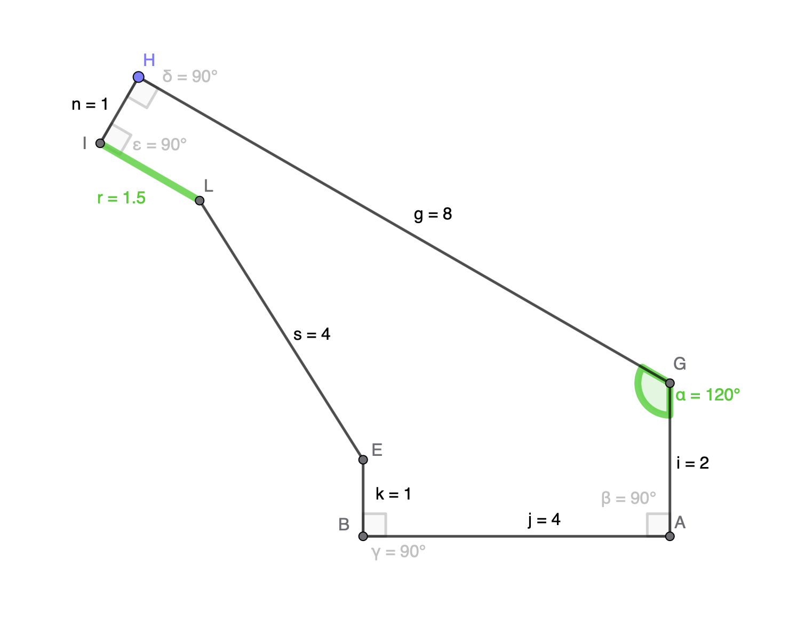

# 🏖️ 🏊‍♂️Jannes's Mallorca Geometry Challenge 2025 🌞 🏄‍♂️

I'm currently stuck on a geometric problem in one of my hobby projects and I need your help! This repository contains a mathematical puzzle that has been blocking my progress, and I'm curious to see how different people or teams approach solving it.

## 🎯 The Challenge

In this challenge, you need to find a formula that calculates the length of side r in a geometric construction based on the angle alpha and several constants.

[](https://www.geogebra.org/classic/nhmywvj7)

### 🌍 Real-World Connection

This challenge is based on a real-world problem I'm trying to solve. While I won't reveal the exact nature of the problem until the end of the challenge (that's part of the fun!), I'm curious to see what participants think it might be. Please include your best guess about what real-world application this geometric construction might represent in your solution.

The construction is available at https://www.geogebra.org/classic/nhmywvj7.

### 😤 Feeling Insulted?

If you're reading this and thinking "This is way too easy!" or "How dare he challenge me with such a trivial exercise that my cat could solve while napping?" - I sincerely and deeply apologise for the insult. I should have paid more attention in class instead of writing SMS on my Nokia 8210. The best way for you to express your disapproval is to submit a correct solution faster than it takes to say "elementary geometry".

### 📝 Problem Statement

Given a geometric construction with the following properties:
- Angle alpha (α) ranges from 90° to 180°
- Constants: n=1.0, g=8.0, i=2.0, j=4.0, k=1.0, s=4.0
- The construction can be explored interactively at https://www.geogebra.org/classic/nhmywvj7
- The challenge is to find a formula that calculates the length of side r as a function of α and the constants
- A reverse formular should also be found - calculating α given r
- The formulas should pass all test cases with precision to 2 decimal places
- Test cases are provided in `tests/test_geometry_challenge.py` with example values

Example test case:
When α = 120°, the formula should yield r ≈ 1.50
When r = 1.50, the reverse formula should yield α ≈ 120°

### 📊 Current Status

The main branch contains a placeholder implementation that fails the tests. Your goal is to implement the correct formulas that make all tests pass.

## 🚀 How to Participate

1. Fork this repository
2. Create a new branch for your solution
3. Set up your development environment:
   ```bash
   # Create a virtual environment
   python -m venv venv

   # Activate the virtual environment
   source venv/bin/activate

   # Install dependencies
   pip install -r requirements.txt
   ```
4. Implement your solution in `src/geometry_challenge.py`
5. Make sure your solution passes all tests by running:
   ```bash
   pytest tests/
   ```
6. Submit a pull request with your solution

## 📁 Project Structure

- `src/geometry_challenge.py`: Contains the formula implementation
- `tests/test_geometry_challenge.py`: Contains the test cases
- `data/`: Directory containing geometry data
  - `simplified_geometry.py`: Test cases and constants for simplified geometry
  - `real_world_geometry.py`: Test cases and constants for real-world geometry
- `.github/workflows/tests.yml`: GitHub Actions workflow that runs tests on every push and PR
- `src/plot.py`: Contains a script that generates a visualisation

### 📊 Visualization

The project includes a plotting script (`src/plot.py`) that helps visualize the relationship between angle α and length r. To generate the plots:

```bash
python -m src.plot
```

This will create a plot in `artifacts/plot.png` showing:
- The calculated r values (blue line)
- The test case values (red dots)
- Separate plots for simplified and real-world geometry

The visualization helps verify the correctness of the implementation by comparing the calculated values against the test cases.

## 📜 Rules

1. You can use any mathematical tools or software to help solve the problem
2. You can work alone or as a team
2. Submit your solution by creating a pull request

## 🏁 Success Criteria

A successful solution must meet the following requirements:

1. Pass all test cases in `tests/test_geometry_challenge.py`
2. Implement a pure geometric/mathematical formula without:
   - If/else statements or conditional logic
   - Lookup tables or hardcoded values
   - Numerical approximation algorithms
3. Be mathematically elegant and demonstrate understanding of the geometric relationships
4. Include clear documentation explaining the mathematical approach
5. Work correctly for any valid input values, not just the test cases

The final determination of what constitutes a valid solution rests with the challenge initiator. Solutions that technically pass the tests but don't reflect the geometric nature of the problem may be rejected.

## ⏰ Timeline

- Challenge Start: Mo May 19 2025
- Submission Deadline: Fri May 23 2025 12:00 CET (might be extended)

## 🏆 Prize

While eternal glory should be enough, the winner of the challenge will also receive the prestigious (and entirely fictional) title of Certified Geomethiast of Mallorca 2025. This honor will be immortalized in a beautifully rendered virtual trophy—and, of course, in the hearts of all who love polygons.

Good luck and happy solving! 🎉
